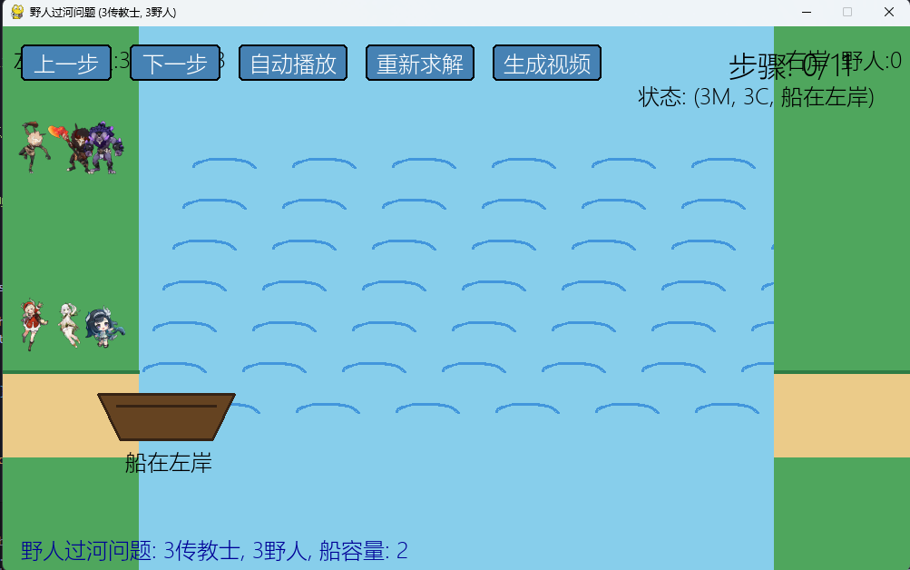

# 野人过河问题可视化求解器
这是一个使用 Python + Pygame 编写的“野人过河 / 传教士与野人”问题可视化求解项目。程序会根据用户输入的传教士数量、野人数量和船的最大容量，使用 BFS（广度优先搜索）自动寻找过河方案，并通过图形界面动态演示每一步移动过程。
项目支持：
- 自定义传教士数量、野人数量和船容量
- 使用 BFS 自动求解最短过河路径
- Pygame 图形化动画演示
- 上一步、下一步、自动播放、重新求解等交互按钮
- 支持键盘快捷键控制
- 支持自定义角色图片
- 支持背景音乐播放
- 支持将自动演示过程导出为 MP4 视频
## 项目效果

运行后会打开一个 Pygame 窗口，界面中包含左右两岸、河流、船只、传教士和野人角色。程序会展示当前状态、当前步骤以及每一步的移动动作。
经典问题示例：
- 传教士数量：3
- 野人数量：3
- 船容量：2
程序会自动搜索出一条合法解法，并可以逐步演示。
## 问题规则
“野人过河问题”的基本规则如下：
1. 左岸最初有若干传教士和野人。
2. 所有人需要乘船到达右岸。
3. 船每次至少载 1 人，最多载 `boat_capacity` 人。
4. 任意一岸如果存在传教士，则野人数不能多于传教士人数。
5. 船只能在两岸之间往返移动。
6. 目标是让所有人安全到达右岸。
程序内部使用状态 `(左岸传教士数量, 左岸野人数量, 船位置)` 表示当前局面，其中：
- `船位置 = 1` 表示船在左岸
- `船位置 = 0` 表示船在右岸
## 项目结构
```text
M&Cproblem/
├── main.py                 # 主程序：求解逻辑、动画界面、交互和视频导出
├── README.md               # 项目说明文档
├── characters/             # 自定义角色图片和背景音乐目录
│   └── 使用说明.txt
└── .venv/                  # 本地虚拟环境，可不上传到 GitHub
```

## 环境要求
建议使用：
- Python 3.10 或更高版本
- Windows 系统运行效果最佳，因为代码中对中文字体和 Windows 终端编码做了适配
主要依赖：
- `pygame`
- `numpy`
- `moviepy`，用于导出视频，可选但推荐安装
## 安装依赖
如果你已经有虚拟环境，可以直接在项目目录下执行：
```bash
pip install pygame numpy moviepy
```
如果你想重新创建虚拟环境，可以执行：
```bash
python -m venv .venv
```
Windows PowerShell：
```bash
.venv\Scripts\activate
pip install pygame numpy moviepy
```
Git Bash：
```bash
source .venv/Scripts/activate
pip install pygame numpy moviepy
```
## 运行项目
在项目根目录执行：
```bash
python main.py
```
程序启动后，会在终端中提示输入参数：
```text
请输入传教士数量 (默认3):
请输入野人数量 (默认3):
请输入船的最大容量 (默认2):
```

如果直接回车，会使用默认值 `3, 3, 2`。
## 操作说明
### 界面按钮
| 按钮 | 功能 |
| --- | --- |
| 上一步 | 回到上一个过河步骤 |
| 下一步 | 前进一步 |
| 自动播放 | 自动播放完整解法，并录制视频帧 |
| 重新求解 | 根据当前参数重新计算解法 |
| 生成视频 | 将已录制的自动播放过程导出为 MP4 视频 |
### 键盘快捷键
| 按键 | 功能 |
| --- | --- |
| 左方向键 | 上一步 |
| 右方向键 | 下一步 |
| 空格键 | 开始 / 暂停自动播放 |
| R | 重置演示 |
## 自定义角色图片
你可以把角色图片放入 `characters/` 文件夹中，程序启动时会自动加载。
支持格式：
- `.png`
- `.jpg`
- `.jpeg`
- `.bmp`
- `.webp`
推荐使用透明背景 PNG 图片。
### 传教士图片命名
可以使用以下命名方式：
```text
missionary_1.png
missionary_2.png
missionary_3.png
```
或者：
```text
m_1.png
m_2.png
m_3.png
```
### 野人图片命名
可以使用以下命名方式：
```text
cannibal_1.png
cannibal_2.png
cannibal_3.png
```

如果只放一张传教士图片和一张野人图片，所有同类角色会重复使用同一张图片。如果放多张图片，程序会循环使用。
## 背景音乐
将 `.mp3` 音乐文件放入 `characters/` 文件夹，程序会自动加载文件夹中的第一首 MP3 作为背景音乐。
背景音乐会在自动播放或步骤动画时播放，演示结束后自动停止。
## 导出视频
项目支持将自动演示过程导出为视频。
使用方式：
1. 点击 `自动播放`，程序会自动播放完整解法并录制帧。
2. 自动播放完成后，点击 `生成视频`。
3. 程序会在项目目录下生成：
```text
river_crossing.mp4
```
如果 `characters/` 中存在 MP3 背景音乐，并且 `moviepy` 可用，导出的视频会自动添加背景音乐。
## 算法说明
程序使用 BFS（广度优先搜索）寻找解法。
核心思路：
1. 从初始状态 `(M, C, 1)` 开始。
2. 枚举当前船所在岸所有可能的乘船组合。
3. 对每个新状态检查是否合法。
4. 使用队列逐层扩展状态。
5. 首次到达目标状态 `(0, 0, 0)` 时，得到最短路径。
由于 BFS 按层搜索，因此找到的第一条解法是移动步数最少的合法解法。
## 注意事项
- 如果输入的人数较大，状态空间会变大，求解和动画显示可能变慢。
- 程序中建议传教士和野人数量不要超过 10。
- 有些参数组合可能不存在合法解法，程序会在终端提示未找到解决方案。
- 如果窗口中文显示异常，请确认系统中安装了微软雅黑、黑体或宋体等中文字体。
- 如果视频导出失败，请确认已安装 `moviepy`，并确保系统可以正常使用视频编码器。
## 上传到 GitHub 的建议
建议不要把 `.venv/` 虚拟环境上传到 GitHub，因为它文件很多且体积较大。可以在项目根目录创建 `.gitignore`，加入：
```text
.venv/
__pycache__/
*.pyc
river_crossing.mp4
```
然后重新提交 README 和其他项目文件。
## 作者
GitHub 用户：`xiaoxiaoyuweixie`
